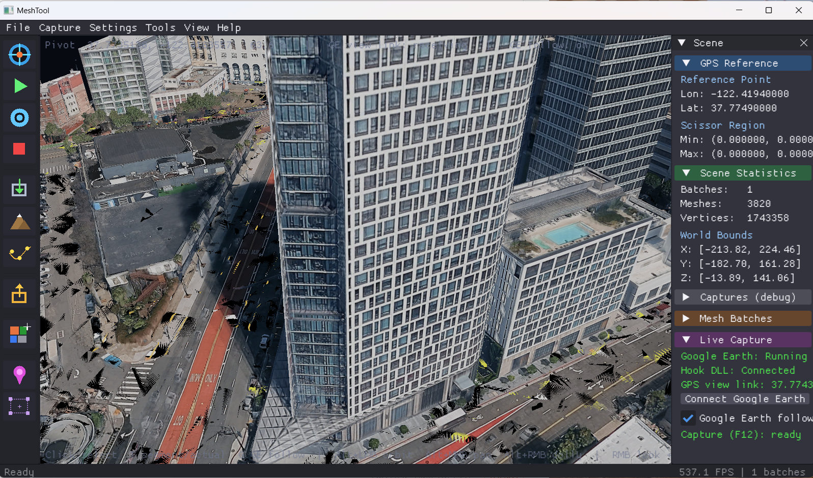
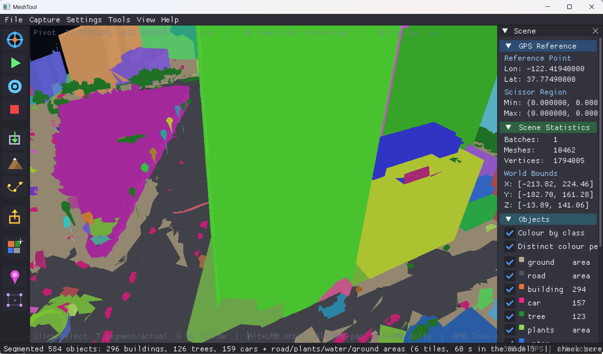

# MeshTool

Captures Google Earth Pro's 3D meshes live, places them at their real GPS
position, stitches overlapping captures into one scene, splits it into objects
(buildings, trees, cars, road, ...) and exports glTF / Maya.

- **Live capture** through a GL hook (`opengl32.dll` proxy / injectable
  `meshtool_hook.dll`), georeferenced through a KML link with Google Earth
- **Stitching** of any number of captures: exact placement from shared tiles,
  duplicate and level-of-detail cleanup, any zoom or camera angle
- **Google Earth follows the viewport**: move in MeshTool, Google Earth flies along
- **AI segmentation** into objects with a local vision model (Ollama)
- **Building refinement**: segmented buildings become clean models (straight
  walls on the captured facades, planar roofs) with glass curtain walls
- **Export** to glTF 2.0 (`.glb` / `.gltf`) and Maya ASCII

Built with GLFW + Dear ImGui + Vulkan (the old Qt6/OpenGL UI was replaced).



*A live capture of downtown San Francisco. The Live Capture panel shows the
GPS link to Google Earth, viewport follow on, and capture ready.*



*The same scene after Tools > Segment Scene: 296 buildings, 126 trees and 159
cars as separate objects (here a distinct colour per building), plus road,
plants, water and ground areas.*

## Guide

A typical session, from an empty scene to an exported model:

1. **One-time setup.** Build (see below), then run `deploy_hook.bat` as
   administrator and pick option 2. This puts the capture hook
   (`opengl32.dll`) next to Google Earth Pro. Redeploy after pulling hook
   changes, with Google Earth closed.
2. **Start.** `run.bat` starts MeshTool with an empty scene. To continue
   earlier work, File > Open Scene (Ctrl+O).
3. **Open Google Earth.** Capture > Navigate & Capture (Ctrl+N) flies Google
   Earth to an address or GPS coordinate. Capture > Launch Google Earth just
   opens it. A Google Earth you started yourself: Live Capture panel >
   **Connect Google Earth**.
4. **Check GPS.** Move Google Earth once and let it stop. The Live Capture
   panel shows *GPS view link: lat, lon* with your location. Captures taken
   before that have no GPS and are set aside from the rest.
5. **Capture.** Frame the area in Google Earth and press **F12** there (or
   F5 / Capture > Capture Frame in MeshTool). Move on to a neighbouring or
   overlapping spot and capture again: captures stitch into one scene, at any
   zoom or camera angle.
6. **Drive from MeshTool (optional).** Press **G**: Google Earth now flies to
   wherever you leave the MeshTool viewport camera. Its overlay shows
   *F12: WAIT - SETTLING* while it flies and loads, then *F12: CAPTURE READY*.
   Press F12 then.
7. **Inspect.** Scene panel > Captures (debug) colours tiles by capture and
   draws the camera path; click any mesh for its details (T toggles
   highlighted / as captured).
8. **Segment.** Tools > Segment Scene (AI) splits the scene into buildings,
   trees, cars, road, plants, water (needs Ollama for best results; see
   below).
9. **Save and export.** File > Save Scene (Ctrl+S) embeds segmentation with the
   scene: object names/classes, building identities and mesh assignments are
   restored by Open Scene without running segmentation again. If segmentation
   or refinement is still running, saving waits for the result. Unrefined
   segmented scenes reopen in class colours; refined scenes show their materials.
   File > Save Scene (Ctrl+S) keeps everything in
   `.mtscene`; File > Export Mesh writes `.glb` / `.gltf` / `.ma`.

**If something looks wrong**

| Symptom | Check |
|---|---|
| GPS view link shows None or 0, 0 | Google Earth lacks MeshTool's links: Connect Google Earth, or restart it from MeshTool. Remove old "MeshTool ..." entries under Temporary Places. |
| A capture lands beside the scene, not in it | It had no GPS and shared no tiles with the scene (see the capture log's `placement` lines). |
| Overlay stays on *WAIT - SETTLING* | `[gate]` lines in the capture log show which condition holds it. |
| Flicker or holes where captures overlap | Capture log `LOD filter` lines; Captures (debug) shows which capture each tile came from. |
| Captures arrive by themselves | Navigate & Capture > *Auto-capture after load* is on. |

Logs: `C:\Users\Public\meshtool_capture.log` (MeshTool side) and
`C:\Users\Public\meshtool_proxy.log` (inside Google Earth).

## Requirements

- Windows 10+, Visual Studio 2022 (x64), CMake >= 3.16, git
- Vulkan SDK (provides `glslc` for shader compilation)
- For Tools > Refine Buildings: Python 3.10+ with CUDA PyTorch and
  `pip install -r tools/building_refine/requirements.txt`; the SAM2
  (`facebook/sam2.1-hiera-small`) and CLIP (`openai/clip-vit-large-patch14`)
  weights download from Hugging Face on first use

## Setup

Run `setup.bat` once. It downloads every dependency into `thirdparty/`
(gitignored) - nothing outside the repo is used. Re-running it skips anything
already present; delete a `thirdparty/<lib>` folder to re-download that one.

| Library | Version | How |
|---|---|---|
| GLFW | 3.4 | git |
| Dear ImGui | 1.90.9 | git |
| nativefiledialog | release_116 | git |
| cpp-httplib | 0.15.3 | git |
| zlib (+ minizip) | 1.3.1 | git |
| expat | 2.6.2 | git |
| uriparser | 0.7.5 | git |
| GeographicLib | 2.3 | git |
| libkml | master | git |
| Boost headers (smart_ptr and deps only) | 1.84.0 | git |
| glm | 1.0.1 | git |
| stb (stb_image, stb_image_write) | master | git |

## Build

```
cmake -S . -B build -G "Visual Studio 17 2022" -A x64
cmake --build build --config Release
```

The source libraries are built as static libs by `cmake/ThirdParty.cmake`.
glm and stb are header-only. The compiled shaders are copied next to `MeshTool.exe`.

## Run

`run.bat` - starts `build\Release\MeshTool.exe` from the repo root, where
`land_ocean_ice_8192.png` and `mesh_tool.cfg` live.

After pulling hook changes, redeploy the proxy (`deploy_hook.bat` as
administrator, option 2): MeshTool and `opengl32.dll` share the capture buffer
layout (16 GB, 64-bit offsets) and must match - an older hook shows "not connected".

## Live capture

MeshTool starts with an empty scene; open a saved scene (Ctrl+O) or capture.
Launch Google Earth from MeshTool (Capture > Launch Google Earth, or Navigate &
Capture), then Capture Frame or F12 inside Google Earth.

- **GPS.** MeshTool loads a KML into Google Earth with two NetworkLinks to its
  local server (`http://127.0.0.1:47321`): `/view` reports Google Earth's view
  when its camera comes to rest, `/follow` is polled for viewport follow. For a
  Google Earth started some other way, Live Capture > **Connect Google Earth**
  loads the links into it. The Live Capture panel shows the last GPS view
  received and its age - capture only once it shows your location. Captures
  are placed in East/North/Up metres at a GPS origin (the first capture's
  look-at point); heights are GE's (above sea level).
- **Merging.** Each capture is matched against every captured area. Tiles
  both contain give the exact camera-to-camera transform (checked per tile in
  the log), whatever the zoom or tilt; without shared tiles, GPS places it if
  it borders an area at a comparable level of detail. Any other capture starts
  a new area beside the others - nothing is replaced. An area captured without
  GPS has no true location and is set to the east of the rest. Overview
  captures (Google Earth zoomed far out, finest tile over 1 km) are dropped by
  the next capture.
- **Duplicates and levels of detail.** Tiles already captured are dropped; a
  quadtree tile captured twice with different data keeps the older copy. Google
  Earth draws coarse tiles under finer ones: coarse triangles that finer tiles
  cover completely are removed, and the rest are drawn slightly behind the finer
  ones (pushed back along the view rays, so their pixels stay put) instead of
  z-fighting them.
- **Google Earth follows the viewport** (G, or the Live Capture checkbox):
  whenever the viewport camera comes to rest, Google Earth flies to the same
  position and direction. Needs a GPS-referenced scene. While following, new
  captures don't reframe the viewport.
- **Capture debug view** (Scene panel > Captures (debug)): colours tiles by the
  capture that produced them and draws each capture's camera, view direction,
  footprint and the path between captures; lists each area's captures with
  placement method and tile counts. Clicking a tile shows its capture.
- **Diagnostics:** `C:\Users\Public\meshtool_capture.log` (placement, shared-tile
  residuals, GPS checks, LOD filter, area moves) and
  `C:\Users\Public\meshtool_proxy.log` (hook side).

## Segmentation

Tools > Segment Scene splits the scene into objects: each building, tree and
car on its own (`building_012`, `tree_007`, `car_003`), plus one object each
for road, plants, water and other ground. Needs [Ollama](https://ollama.com)
with a vision model (default `qwen3.8:latest`); without it, classes come from
colour and height only.

1. The mesh is rendered top-down (0.25 m/pixel): colour, height, coverage.
2. A ground model (lowest points flooded across max-35% slopes, local plane
   fits) gives height above ground - exact on slopes and hills.
3. Raised areas split into instances at height breaks (1.5 m, or 8% of the
   height for towers, so terraced crowns stay whole); steep facade pixels join
   the highest roof they hang from. Tiers / towers / rooftop structures that
   stand on a lower part holding most of their outline are merged into it, and
   so are pieces too slender to stand alone (facade ledges and fins: footprint
   under 3% of height squared) into the taller part they touch. Ground split
   into colour regions.
4. The model labels numbered regions on 768 px tiles, told which are raised;
   answers are schema-constrained JSON.
5. Triangles seen from above join the object under them; walls inherit
   their roof's object along the mesh, flowing only downward (so ground never
   climbs a wall); walls in tiles not stitched to their roof look behind
   themselves (against the normal) for a roof that reaches their top; stray
   triangles take the object of their mesh neighbours,
   and meshes are split per object. Objects are saved in `.mtscene` and name the
   glTF nodes.

When segmentation finishes, the 3D viewport is saved twice for checking -
class colours and original textures - as
`screenshots\check_<time>_segment.png` / `_original.png` in the MeshTool folder.
Tools > Save Check Screenshots takes the pair again from the current view.
Each run also saves its input as `last_input.mtscene` in the debug folder, so it
can be re-run and checked offline:

```
MeshTool --segment last_input.mtscene out.mtscene [--no-model] [--debug-dir d] [--dump]
MeshTool out.mtscene --shots prefix [--frame building_012] [--yaw 30] [--pitch -20] [--zoom 0.85]
```

`--dump` adds raw rasters (`top.f32`, `object.i32`), `objects.txt` and per-triangle
labels (`tris.bin`) to the debug folder; `--shots` opens a scene, aims at an
object, saves the check-screenshot pair and exits.

Scene panel > Objects: colour by class, show/hide classes. Debug images
(orthophoto, regions, classes, marked tiles) and a log go to
`C:\Users\Public\meshtool_segment\`. Headless:
`MeshTool.exe --segment in.mtscene out.mtscene [--no-model] [--res m]`.

## Refine Buildings

Tools > Refine Buildings (needs a segmented scene) replaces each building with a
clean model and loads the result in place of the current scene (save it with
File > Save Scene). The work is done by `toolsuilding_refine
efine.py`, run
with `python` from PATH (or `MESHTOOL_PYTHON`) on a copy of the scene.

1. **Outline**: the building's top-down mask, sharpened by SAM2 on the orthophoto.
2. **Roof**: split into planes (RANSAC + region growing); planes flatter than 4°
   become level.
3. **Walls**: for each roof part, a horizontal slice through the captured mesh
   just below that roof gives where the facade really stands (not the roof edge,
   which parapets, canopies and overhangs push off it); edges near the
   building's main directions are straightened onto them.
4. **Textures**: each new face is textured by projecting the original mesh onto
   it (8 cm per texel), so the model keeps the captured look.
5. **Glass**: CLIP classifies 3 m facade cells; curtain walls get the glass
   material (darker texels are panes: translucent over a dark interior, sky
   reflection with Fresnel; the frame stays opaque). Scene panel > Objects >
   Glass facades sets opacity and reflection.

A building is replaced only if its walls lie on the captured facades (at least
65% of the street-facing wall area within 1.5 m); buildings at the edge of the
capture, small ones and poor fits keep their captured mesh. Facade slivers the
segmenter split off are absorbed into the refined building next to them.
Progress and the log (`refine.log`) go to the segmentation debug folder.

**Clean scene** (checkbox / `--clean`) goes further: cars (including buses and
vans the segmenter made into a small building or tree) and surface clutter
(people, poles, bins, parked-car rows left in a ground class: raised blobs under
60 m²) are removed, and ground,
roads, plants and water are rebuilt as one textured height field from the
top-down raster - holes under trees, cars, clutter and buildings are filled from
their surroundings - heights geometrically, the orthophoto with LaMa image
inpainting, so lane markings, kerbs and paving continue across the filled area
(`--no-lama` for a plain geometric fill; the 200 MB `big-lama.pt` downloads once
into `~/.cache/meshtool`) - with refined walls set down onto it.
Trees keep their captured meshes. The result is one terrain mesh per class
(0.5 m grid, `--terrain-step`) on 2048 px orthophoto pages.

**Remove hidden surfaces** (checkbox / `--cull`, always on with clean) deletes
triangles no view from above the horizon sees: ~60 orthographic views
rasterize triangle ids; coincident surfaces (the z-fighting) are settled by
priority - refined models and terrain over captured, textured over Google
Earth's dark overlay tiles, earlier over later - so one of two coincident
triangles survives. Trees never occlude (what is under them stays for when
trees are hidden). Undersides seen only from below are lost.

Google Earth's captures carry placeholder textures: a near-black overlay pass
drawn over the ground tiles at the same depth, and a yellow/black checker on
tiles whose imagery had not streamed in. refine.py draws triangles with such
textures last (they lose every depth tie to their textured twins), never bakes
or textures from them, fills their colour from the surrounding surface, and
with Clean scene drops the ones lying on the rebuilt terrain.

```
MeshTool --refine in.mtscene out.mtscene [--no-glass] [--clean] [--cull]
python toolsuilding_refine
efine.py in.mtscene out.mtscene [--only building_012,...] [--no-sam] [--no-glass] [--clean] [--cull] [--no-lama] [--debug-dir d]
MeshTool --objects in.mtscene [out.mtscene] [--remove car]
MeshTool scene.mtscene --shots prefix --box x0 y0 z0 x1 y1 z1 [--no-glass] [--yaw ..] [--pitch ..] [--zoom ..]
```

`--objects` lists a segmented scene's objects (name, class, size, centre) and
can drop a class; `--box` frames a fixed world box, so shots of two scenes line
up for before/after comparison.

## Scene files

File > Save Scene / Open Scene (Ctrl+S / Ctrl+O): `.mtscene`, MeshTool's
lossless native format - meshes, textures as captured, GPS origin, segmented
objects and (version 4) each mesh's material (captured, glass, interior).

## Viewport

| | Maya style | Unreal style |
|---|---|---|
| Orbit / look | Alt + LMB | RMB drag (look around) |
| Pan | Alt + MMB | MMB, or LMB + RMB |
| Dolly / move | Alt + RMB | LMB drag (forward/back + turn) |
| Fly | | RMB + W/A/S/D, Q/E down/up; wheel = speed, Shift = faster |

Wheel zooms to the pivot, F frames everything.

Click a mesh to select it (Scene panel > Selected Object: class, size, GPS,
capture; Isolate / Frame / Clear); T switches the selection between highlighted
and as captured. G toggles Google Earth following the viewport.

## Export

File > Export Mesh writes glTF 2.0, picked by the extension you type:

- `.glb` - one self-contained file, textures embedded
- `.gltf` - JSON + `<name>.bin`, textures in `<name>/textures/`
- `.ma` - Maya ASCII

Meshes keep their world-space offset as node translations (source data is
Z-up; a root node rotates it to glTF's Y-up). Materials use
`KHR_materials_unlit`, since the captured textures already have lighting baked in.

## Targets

- `MeshTool` - main app
- `GLHookDLL` (`opengl32.dll`) - proxy DLL, deploy with `deploy_hook.bat`
- `GLHookInject` (`meshtool_hook.dll`) - injectable hook used by live capture
- `GLHookTest` (`opengl32_test.dll`) - forwarding-only proxy for debugging
- `test_inject` - inject `meshtool_hook.dll` into a running process by name or PID
